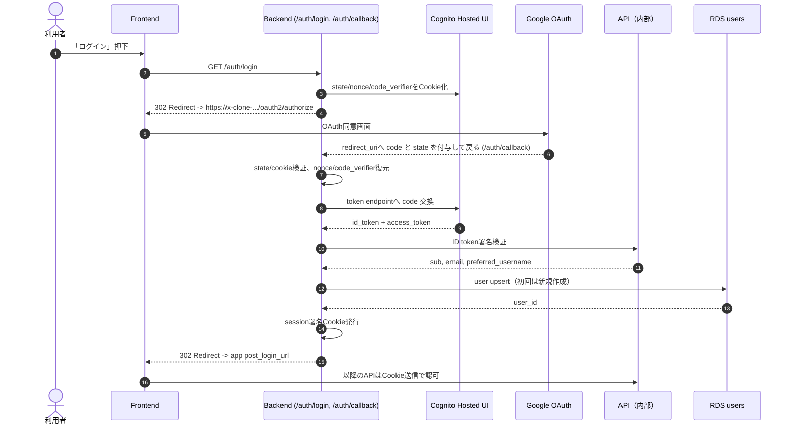
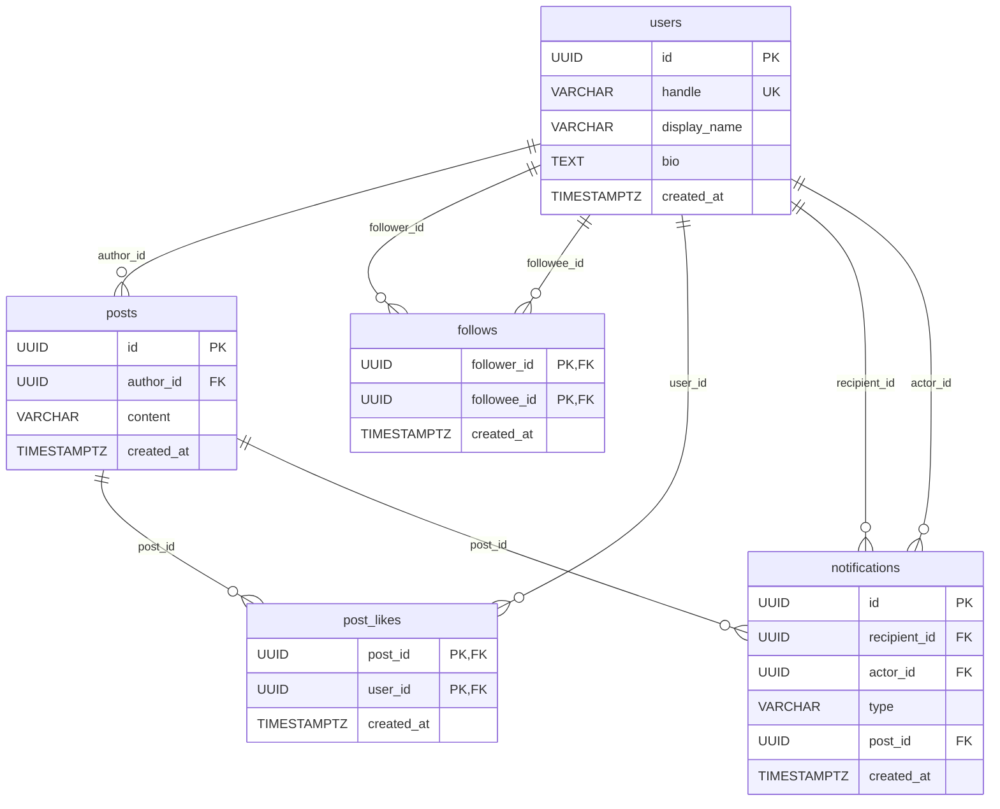

# Design Doc

## 1. 開発方針

```text
課題全体の完成
├── Milestone 1: 初期実装・ローカル開発基盤
│   ├── issue: フロントエンドの初期構成と画面を実装する
│   ├── issue: Goバックエンドの初期構成を作成する
│   ├── issue: データベース環境を構築する
│   ├── issue: バックエンドAPIの基本構成を整備する
│   ├── issue: 投稿機能をバックエンドから実装する
│   ├── issue: フォロー機能をフロントエンドからデータベースまで実装する
│   └── issue: タイムライン機能を実装する
├── Milestone 2: Terraform・CI/CDを含むデプロイ基盤の構築
│   ├── issue: AWS stg環境を構築し、ECSでAPI起動とマイグレーションを確認する
│   ├── issue: AWSリソースの役割・依存関係・命名を整理する
│   ├── issue: DBユーザー管理・マイグレーション実行基盤を整理する
│   ├── issue: フロントエンドをstg環境へデプロイし、API・RDSとの疎通を確認する
│   └── issue: ECRへのイメージpushとECSへの反映を自動化する
└── Milestone 3: 本番品質化
    └── issue: Google OIDCによるログイン機能を実装する
```

Milestoneは関連するIssueを段階ごとにまとめ、Issueは個別の作業を管理する。

Issueごとに`develop`ブランチから作業ブランチを作成し、作業完了後に`develop`へのPull Requestを作成する。各Issueの変更を`develop`に統合し、必要な単位で`main`へ反映する。

## 2. AIの活用方針

### 使用したツール

- OpenAI Codex
- 作業ルール：[AGENTS.md](../AGENTS.md)

### Codexに任せたこと

- コードの初期実装
- テストコードの作成案
- エラー原因の調査
- 実装方針の比較案作成

### 自分で判断・検証したこと

- 採用する技術とアーキテクチャ
- APIとデータモデルの設計
- Codexが生成したコードのレビュー
- テスト実行と動作確認
- Design Docの内容

### 活用時に意識したこと

Codexの提案をそのまま採用せず、実装内容を確認し、テストや動作確認を行ったうえで採用可否を判断した。

## 3. 要件の整理

### 機能要件

本課題では、Twitter APIクライアントではなく、サービスとしてのTwitterクローンを開発する。

#### 必須要件（課題文で指定）

- ツイートする
- 他ユーザーをフォローする
- タイムラインを見る

#### 追加・補足要件

- おすすめユーザーは、フォロー機能の動作確認用として固定のモックデータを表示する
- おすすめ対象の選定ロジックやランキングは、今回の必須要件の対象外とする

### 非機能要件

#### 必須要件（課題文で指定）

- WebフロントエンドはTypeScriptとReactを利用する
- バックエンドはGo言語を利用する
- 3〜6名程度のチームでアジリティ高く開発でき、新しいメンバーも参加しやすい構成にする
- 各開発者のラップトップ上で普段の開発を行えるようにする
- AWSなどのパブリッククラウドにデプロイし、顧客へ提供できることを考慮する
- ユーザー体験、将来の拡張性、セキュリティ、エラーハンドリングなどの横断的な関心事を考慮する

#### 追加・補足要件

- 現段階では、必須要件の実装と検証を優先する
- 必須要件に含まれないおすすめユーザーの選定ロジックは、必要性を判断したうえで将来の拡張課題とする

## 4. 技術選定とトレードオフ

### フロントエンドの技術構成

#### UIライブラリ・フレームワーク

| 採用 | 選択肢  | 役割                  | 判断理由                                                                   |
| ---- | ------- | --------------------- | -------------------------------------------------------------------------- |
| ⭕️   | React   | UIライブラリ          | 課題の指定技術。Go APIと分離したSPAを構築する                              |
| —    | Next.js | Reactのフレームワーク | SSR、Server Components、Next.js側のAPIなどが今回不要。別サーバー層も増える |

#### ビルドツール・バンドラー

| 採用 | 選択肢    | 役割                                           | 判断理由                                                  |
| ---- | --------- | ---------------------------------------------- | --------------------------------------------------------- |
| ⭕️   | Vite      | 開発サーバーと本番ビルドを提供するビルドツール | 設定がシンプルで起動・変更反映が速く、React SPAに必要十分 |
| —    | webpack   | バンドラーと開発基盤                           | 実績は豊富だが、今回のSPAでは設定や周辺ツールが過剰       |
| —    | Rspack    | webpack互換を意識した高速なバンドラー          | webpack互換性や大規模ビルドが現時点で不要                 |
| —    | Turbopack | Next.jsなどで利用される高速なバンドラー        | 今回はNext.jsを採用しないため対象外                       |

#### JavaScript・TypeScript変換

| 採用 | 選択肢            | 役割                             | 判断理由                                         |
| ---- | ----------------- | -------------------------------- | ------------------------------------------------ |
| ⭕️   | SWC / esbuildなど | TypeScriptや最新JavaScriptの変換 | Viteの設定に任せ、個別の変換基盤を追加しない     |
| —    | Babel             | JavaScript・TypeScript変換       | 柔軟で実績はあるが、今回の構成では追加設定が不要 |

#### SPAのルーティング

| 採用 | 選択肢             | 役割                       | 判断理由                                                     |
| ---- | ------------------ | -------------------------- | ------------------------------------------------------------ |
| ⭕️   | React Router v7    | SPAのURLと画面を対応付ける | React + Viteに導入しやすく、現時点ではDeclarative Modeで十分 |
| —    | Next.js App Router | Next.jsのルーティング      | Next.jsを採用しないため今回は利用しない                      |

#### テスト基盤

| 採用 | 選択肢 | メリット                                         | トレードオフ・判断理由                                                   |
| ---- | ------ | ------------------------------------------------ | ------------------------------------------------------------------------ |
| ⭕️   | Vitest | Viteと設定やモジュール変換の考え方を共有しやすい | 今回のVite構成に合わせやすいため採用                                     |
| —    | Jest   | Reactを含むエコシステムで実績と情報量が多い      | Viteとは別に変換設定などを整える必要があり、今回はVitestより設定が増える |

### フロントエンドの配信方式

| 採用 | 選択肢                   | 役割                      | 判断理由                                                                                                                                                                                        |
| ---- | ------------------------ | ------------------------- | ----------------------------------------------------------------------------------------------------------------------------------------------------------------------------------------------- |
| ⭕️   | Amplify                  | フロントエンド配信・CI/CD | React + ViteのSPAを簡単に公開でき、GitHub連携による自動ビルド・デプロイ、PRプレビュー、独自ドメイン設定をまとめて扱える。細かな配信制御よりも、stg公開とAPI疎通確認を早く進めることを優先する。 |
| —    | CloudFront + S3 + Lambda | フロントエンド配信基盤    | 柔軟性が高く、CDNやLambda@Edgeで細かな制御ができる一方、S3、CloudFront、IAM、キャッシュ、CI/CDを個別に設計・管理する必要があり、今回のSPA公開には重い。                                         |
| —    | Vercel                   | フロントエンド配信・CI/CD | デプロイやPRプレビューは簡単だが、AWS外のサービスになる。今回はAWS上の環境との統合を優先するため採用しない。                                                                                    |
| —    | Firebase Hosting         | フロントエンド配信        | 簡単なデプロイと高速CDNを利用できるが、Googleサービス寄りの構成になる。今回はAWSリソースとの連携を優先するため採用しない。                                                                      |

### バックエンド

| 採用 | 選択肢                   | 役割             | 判断理由                                                                                                            |
| ---- | ------------------------ | ---------------- | ------------------------------------------------------------------------------------------------------------------- |
| ⭕️   | Go                       | APIサーバー      | 課題の指定技術。コンパイル時の型検査と標準ライブラリのHTTP・context機能を活用し、単一バイナリとしてデプロイできる。 |
| ⭕️   | `net/http` + gorilla/mux | HTTPルーティング | HTTPの標準的なインターフェースを維持しつつ、HTTPメソッド・パスパラメータごとのルート定義を簡潔に記述できる。        |
| —    | Go標準ライブラリのみ     | HTTPルーティング | 依存を減らせる一方、現時点で必要なパスパラメータの取得やルート定義が冗長になりやすい。                              |
| —    | chi                      | HTTPルーティング | 軽量でGoらしい選択肢だが、gorilla/muxで必要な機能を満たしており、移行する理由がない。                               |

### データベース

| 採用 | 選択肢     | 役割     | 判断理由                                                                                              |
| ---- | ---------- | -------- | ----------------------------------------------------------------------------------------------------- |
| ⭕️   | PostgreSQL | アプリDB | 外部キー、制約、トランザクションを厳密に扱いやすい。JOIN、集約、JSONBなどの機能も豊富で拡張しやすい。 |
| —    | MySQL      | アプリDB | 一般的なCRUD中心のサービスでは十分な選択肢だが、今回はPostgreSQLの型・クエリ・拡張性を優先した。      |

### インフラ基盤

| 採用 | 選択肢          | 役割         | 判断理由                                                                                                                     |
| ---- | --------------- | ------------ | ---------------------------------------------------------------------------------------------------------------------------- |
| ⭕️   | AWS             | クラウド基盤 | 課題でパブリッククラウドへのデプロイを考慮する必要があり、ECS、RDS、ECR、Secrets Managerなどを一つのクラウド内で構成できる。 |
| —    | Google Cloud    | クラウド基盤 | Cloud RunやCloud SQLなどで同等構成は可能だが、今回はAWSの学習・検証を優先する。                                              |
| —    | Azure           | クラウド基盤 | コンテナ実行やDBのマネージドサービスは利用できるが、今回の検証対象から外す。                                                 |
| —    | Heroku / Render | PaaS         | 構築は簡単だが、VPC、IAM、セキュリティグループ、RDS相当の構成管理を学習・検証しづらい。                                      |

### IaC

| 採用 | 選択肢             | 役割     | 判断理由                                                                                                                    |
| ---- | ------------------ | -------- | --------------------------------------------------------------------------------------------------------------------------- |
| ⭕️   | Terraform          | IaC      | AWSリソースを宣言的に管理でき、クラウドやサービスをまたいだ構成にも対応しやすい。Stateにより差分確認と再作成もしやすい。    |
| —    | AWS CloudFormation | IaC      | AWS純正で統合度は高いが、記述量が増えやすく、今回はTerraformの汎用性を優先した。                                            |
| —    | AWS CDK            | IaC      | プログラミング言語で抽象化できる一方、生成されるCloudFormationの理解も必要になるため、今回はTerraformでリソースを明示する。 |
| —    | Pulumi             | IaC      | GoやTypeScriptで書けるが、今回の目的ではTerraformの情報量と学習効果を優先した。                                             |
| —    | 手動構築           | 構築方法 | 初期検証は速いが、再現性が低く、変更履歴やレビューが残りにくいため採用しない。                                              |

### CDのAWS認証方式

| 採用 | 選択肢                 | 役割                         | 判断理由                                                                                                                                 |
| ---- | ---------------------- | ---------------------------- | ---------------------------------------------------------------------------------------------------------------------------------------- |
| ⭕️   | GitHub OIDC            | GitHub ActionsからAWS API実行 | 長期AWSアクセスキーをGitHub Secretsへ保存せず、一時認証でAmplify・ECR・ECSへのデプロイを実行できるため採用する。                         |
| —    | GitHub SecretsのAWSキー | GitHub ActionsからAWS API実行 | 実装は単純だが、長期キーをGitHub Secretsで管理する必要があるため採用しない。                                                             |

### ログイン方式

| 採用 | 選択肢 | 役割 | 判断理由 |
| ---- | ------ | ---- | -------- |
| ⭕️   | Cognito Hosted UI + Google OIDC | 利用者ログイン | Googleアカウントで実在ユーザーを確認でき、認証画面・OAuth/OIDC連携をアプリ側で自前実装しなくてよいため採用する。 |
| —    | アプリ独自のメール・パスワード認証 | 利用者ログイン | パスワード保存、リセット、MFAなどの実装・運用責務が増えるため採用しない。 |
| —    | 独自WebAuthn/パスキー | 利用者ログイン | セキュアだが実装範囲が大きい。今回はGoogle OIDCを先に実装し、パスキーは後続検討にする。 |

### BFFでのセッション管理

ブラウザは`/auth/login`からCognito Hosted UIへ遷移し、ログイン後に`/auth/callback`へ戻る。backendはauthorization codeをtokenへ交換し、ID tokenを検証してアプリ内ユーザーを作成・取得する。

ブラウザのJavaScriptへCognito tokenを渡さない。backendは認証済みユーザーIDを署名済みsessionとしてhttpOnly、Secure、SameSite=Lax Cookieへ保存し、以降のAPIリクエストではCookieからユーザーIDを復元する。



AWSリソース構成、セキュリティグループ、IAM、DBユーザー、Secret管理方針の詳細は[infrastructure/ARCHITECTURE.md](infrastructure/ARCHITECTURE.md)にまとめる。

※この図はセッション復元フローを簡略化している。実装上は、`state/nonce/PKCE`は環境別prefix付きの一時Cookieで保存し、callback時に検証した後に即時破棄する。

## 5. CI/CD

### 全体方針

CIはPull Request更新時に実行し、CDはPull Requestがmergeされてdevelop/mainへpushされた時に実行する。PR上でCIを必須にすることで、CIが失敗した変更をmergeしない運用にする。

| Workflow | 起動条件 | 主な処理 |
| -------- | -------- | -------- |
| .github/workflows/frontend-ci.yml | frontend変更を含むPull Request | frontendのformat:check・test・build |
| .github/workflows/backend-ci.yml | backend変更を含むPull Request | backendのgofmt・go test・go vet |
| .github/workflows/frontend-cd.yml | frontend変更がdevelop/mainへpushされた時。必要に応じて手動実行も可能 | merge後のcommitをcheckoutし、frontendをbuildしてdistのZIPをAmplify Hostingへデプロイ |
| .github/workflows/backend-cd.yml | backend変更がdevelop/mainへpushされた時。必要に応じて手動実行も可能 | merge後のcommitをcheckoutし、API・db-migratorイメージをECRへpush。db-migrator単発タスク実行後、ECSサービスapiを更新 |

### 環境切り替え

developはstg環境、mainはprd環境へデプロイする。CDはdevelop/mainへのpushで起動するため、環境判定には`github.ref_name`を使う。手動実行時は`workflow_dispatch`の入力でstg/prdを明示選択する。IAMロールARNはGitHub Secretsで管理し、それ以外の環境値はGitHub Variablesで管理する。

| 種別 | 名前 | 用途 |
| ---- | ---- | ---- |
| Secret | AWS_ROLE_ARN_STG / AWS_ROLE_ARN_PRD | GitHub ActionsがOIDCで引き受ける環境別IAMロールARN |
| Variable | AWS_ACCOUNT_ID_STG / AWS_ACCOUNT_ID_PRD | 環境別AWSアカウントID。ECRレジストリURLを組み立てる |
| Variable | AWS_REGION | AWSリージョン |
| Variable | AMPLIFY_APP_ID_STG / AMPLIFY_APP_ID_PRD | 環境別Amplify AppのID |
| Variable | AMPLIFY_BRANCH_NAME_STG / AMPLIFY_BRANCH_NAME_PRD | 環境別Amplify Branch名 |
| Variable | ECS_CLUSTER_NAME | ECSクラスター名 |
| Variable | ECS_SERVICE_NAME | ECSサービス名 |
| Variable | API_TASK_FAMILY | APIタスク定義family |
| Variable | MIGRATION_TASK_FAMILY | マイグレーションタスク定義family |
| Variable | API_ECR_REPOSITORY | API用ECRリポジトリ名 |
| Variable | MIGRATION_ECR_REPOSITORY | マイグレーション用ECRリポジトリ名 |
| Variable | API_HEALTH_URL_STG / API_HEALTH_URL_PRD | 環境別API health check URL |
| Variable | DEPLOY_ENV_STG / DEPLOY_ENV_PRD | サブネット・SG取得用の環境名 |

GitHub Actionsには次の値を設定する。

| 種別 | 名前 | stg | prd |
| ---- | ---- | --- | --- |
| Secret | AWS_ROLE_ARN_* | github-actions-cdロールARN | github-actions-cdロールARN |
| Variable | AWS_ACCOUNT_ID_* | 089244387218 | 517037063215 |
| Variable | AMPLIFY_APP_ID_* | d2judt2uwax9h6 | d1o16modss0jxj |
| Variable | API_HEALTH_URL_* | https://api-v1.stg.x-clone.kyo8.dev/health | https://api-v1.x-clone.kyo8.dev/health |
| Variable | DEPLOY_ENV_* | stg | prd |
| Variable | AWS_REGION | ap-northeast-1 | ap-northeast-1 |
| Variable | AMPLIFY_BRANCH_NAME_* | stg | prd |
| Variable | ECS_CLUSTER_NAME | x-clone | x-clone |
| Variable | ECS_SERVICE_NAME | api | api |
| Variable | API_TASK_FAMILY | api | api |
| Variable | MIGRATION_TASK_FAMILY | db-migrator | db-migrator |
| Variable | API_ECR_REPOSITORY | api | api |
| Variable | MIGRATION_ECR_REPOSITORY | db-migrator | db-migrator |

### backend CDの実行順序

backend CDでは、DockerfileからAPI用イメージとマイグレーション用イメージを作成する。2つのイメージビルドは同じDockerfileのbuild stageを通るため、BuildKitのキャッシュを利用しつつ直列で実行する。

イメージ作成後は、マイグレーション実行とAPIタスク定義登録を並行実行する。両方が成功してからECSサービスを更新する。

```text
develop/mainへbackend変更をmerge
  ↓
build-images
  ↓
  ├─ run-migration
  └─ register-api-task-definition
        ↓
update-api-service
```

## 6. システム構成とデータモデル

### バックエンドの構成

Goバックエンドは、HTTPサーバーの起動、ルーティング、HTTPリクエスト処理、業務ロジック、データアクセスの責務を分ける。`cmd/api`、`internal/controllers`、`internal/services`、`internal/repositories`、`internal/models`を使用し、投稿・フォロー・タイムラインを実装する。

```text
cmd/api/main.go
    │ DB初期化・サーバー起動
    ▼
internal/routers/router.go
    │ service・controllerの生成、ルート登録
    ▼
internal/controllers/
    │ HTTPリクエスト・レスポンス処理
    ▼
internal/services/
    │ 業務ロジック
    ▼
internal/repositories/ ── DBアクセス
    │
internal/models/ ─────── データモデル
```

`main.go`ではDBを初期化して`routers.NewRouter(db)`へ渡す形を維持する。controllerを個別に`NewRouter`の引数へ追加せず、必要なcontrollerやserviceの生成は`router.go`に集約することで、アプリケーションの組み立てとルート定義を追いやすくする。health endpointのようにDBやserviceを必要としない処理は、controller単体で実装する。

### データベースの構成

ユーザー、投稿、フォロー関係、いいね、通知はそれぞれテーブルで管理する。ユーザーごとにテーブルを作成するのではなく、`follows`テーブルの各行で「誰が誰をフォローしたか」を表す。



`follows`は、同じ`users`テーブルを2つの役割で参照する。たとえば田中が佐藤をフォローすると、`follower_id`は田中のID、`followee_id`は佐藤のIDとなる。`(follower_id, followee_id)`を複合主キーにすることで、同じユーザーを重複してフォローできない。また、`follower_id <> followee_id`の制約により、自分自身のフォローを防ぐ。

タイムライン取得時は、`posts.author_id`と`users.id`を結合して投稿者情報を取得する。`following`タイムラインでは、さらに`follows.followee_id`と投稿者IDを結合し、`follows.follower_id`が現在のユーザーである投稿だけを残す。現時点の`for-you`は推薦機能ではなく、全投稿を新しい順で表示する。

いいねは`post_likes`で管理し、`(post_id, user_id)`を複合主キーにすることで同じ投稿への重複いいねを防ぐ。フォロー・いいねの発生時には`notifications`へ通知を保存する。通知は`recipient_id`が通知を受け取るユーザー、`actor_id`が操作したユーザーを表し、`type`で`follow`と`like`を区別する。現時点では通知の既読・未読は管理せず、通知一覧は自分宛ての通知を新しい順で取得する。

## 7. 今後の拡張性や運用を見据えた懸念点

- OAuthセッションの多端末同時運用（マルチセッション）
  - 現在はAPI側sessionの上書き方式で単一端末運用を前提にしている。
  - 将来的に「同じブラウザ内」「同一ユーザーの別デバイス」でも状態を失わせないため、サーバ側でセッション履歴を明示管理し、最終ログイン更新を可視化したい。
  - 旧Cookie名残り（移行期間）と今後の新規prefix戦略が競合しない運用ルールが必要。
- 通知基盤を機能拡張していく際の整合性
  - 現在は通知の既読管理は未実装で、表示順序の安定性・重複排除に依存する。
  - リプライ/リポスト実装時は「起点投稿」「被引用投稿」「返信ツリー」の通知ルールを明確化し、通知種別を拡張する必要がある。
- 返信（リプライ）機能
  - postsテーブルとルーティングは拡張可能だが、返信先UI、検索や表示ロジック、通知連動、ミュート/非表示制御が追加で必要。
  - タイムラインのソート・取得制御で「通常/返信のみ」を切り分ける設計が必要。
- リポスト機能
  - 引用投稿・引用元保持・重複抑止の仕様を定義しないと、投稿表示で循環参照や無限表示が起きやすい。
  - repost元の権限（元投稿削除、編集、非表示）と表示順の扱いは初期要件外だが事前に設計しておく必要がある。
- 運用上のデプロイ観点
  - task definition更新はCDで再起動されるが、stg/prdのトラフィック集中時はロールアウト速度とヘルスチェック待機がボトルネックになりやすい。
  - 通知、ユーザー名変更、Cookie名変更などのユーザー体験影響があり、リリース時はログイン再試行導線を必ず検証する。
- セキュリティ運用
  - ログ監査は`AUTH_COOKIE_NAME_PREFIX`やキー更新時の旧Cookie残存を前提に、失効時の再ログイン率をメトリクス化したい。
  - Google OIDCのクライアント情報ローテーション（secret/version）に対し、Terraform変数・Secrets更新とCDパイプラインを分離し、事故時は手動ロールバックが可能な状態にする。
