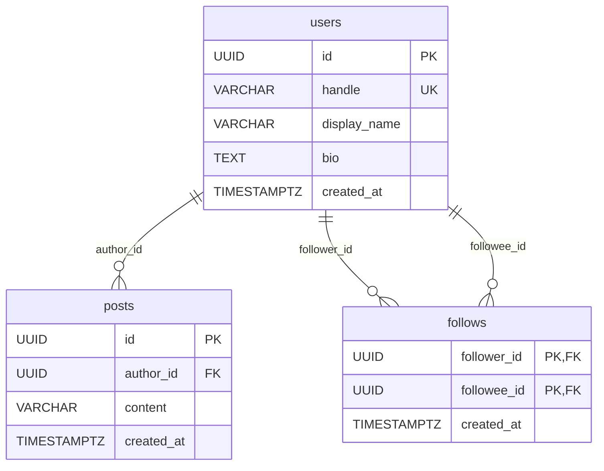

# Design Doc

## 1. 開発方針

```
課題全体の完成
├── Milestone 1: ローカル開発基盤の構築
│   └── 複数のIssue（フロントエンド、バックエンド、DB、APIなど）
├── Milestone 2: Terraform・CI/CDを含むデプロイ基盤の構築
│   └── 複数のIssue（AWS、Terraform、CI/CDなど）
├── Milestone 3: 必須機能の実装
│   └── 複数のIssue（ログイン、投稿、フォロー、タイムラインなど）
└── Milestone 4: 本番環境の構築・運用準備（予定）
    └── 複数のIssue（本番環境、セキュリティ、監視、バックアップなど）
```

Milestoneは関連するIssueを段階ごとにまとめ、Issueは個別の作業を管理する。

Issueごとに `develop` ブランチから作業ブランチを作成し、作業完了後に `develop` へのPull Requestを作成する。各Issueの変更を `develop` に統合し、Milestoneが完了した時点で `develop` から `main` へのPull Requestを作成する。

## 2. AIの活用方針

### 使用したツール

- OpenAI Codex
- 作業ルール：[AGENTS.md](../AGENTS.md)

### Codexに任せたこと

- コードの初期実装
- テストコードの作成案
- エラー原因の調査
- 実装方針の比較案作成

### 自分で判断・検証したこと

- 採用する技術とアーキテクチャ
- APIとデータモデルの設計
- Codexが生成したコードのレビュー
- テスト実行と動作確認
- Design Docの内容

### 活用時に意識したこと

Codexの提案をそのまま採用せず、実装内容を確認し、テストや動作確認を行ったうえで採用可否を判断した。

## 3. 要件の整理

### 機能要件

本課題では、Twitter APIクライアントではなく、サービスとしてのTwitterクローンを開発する。

#### 必須要件（課題文で指定）

- ツイートする
- 他ユーザーをフォローする
- タイムラインを見る

#### 追加・補足要件

- おすすめユーザーは、フォロー機能の動作確認用として固定のモックデータを表示する
- おすすめ対象の選定ロジックやランキングは、今回の必須要件の対象外とする

### 非機能要件

#### 必須要件（課題文で指定）

- WebフロントエンドはTypeScriptとReactを利用する
- バックエンドはGo言語を利用する
- 3〜6名程度のチームでアジリティ高く開発でき、新しいメンバーも参加しやすい構成にする
- 各開発者のラップトップ上で普段の開発を行えるようにする
- AWSなどのパブリッククラウドにデプロイし、顧客へ提供できることを考慮する
- ユーザー体験、将来の拡張性、セキュリティ、エラーハンドリングなどの横断的な関心事を考慮する

#### 追加・補足要件

- 現段階では、必須要件の実装と検証を優先する
- 必須要件に含まれないおすすめユーザーの選定ロジックは、必要性を判断したうえで将来の拡張課題とする

## 4. 技術選定とトレードオフ

### フロントエンドの技術構成

#### UIライブラリ・フレームワーク

| 採用 | 選択肢  | 役割                  | 判断理由                                                                   |
| ---- | ------- | --------------------- | -------------------------------------------------------------------------- |
| ⭕️   | React   | UIライブラリ          | 課題の指定技術。Go APIと分離したSPAを構築する                              |
| —    | Next.js | Reactのフレームワーク | SSR、Server Components、Next.js側のAPIなどが今回不要。別サーバー層も増える |

#### ビルドツール・バンドラー

| 採用 | 選択肢    | 役割                                           | 判断理由                                                  |
| ---- | --------- | ---------------------------------------------- | --------------------------------------------------------- |
| ⭕️   | Vite      | 開発サーバーと本番ビルドを提供するビルドツール | 設定がシンプルで起動・変更反映が速く、React SPAに必要十分 |
| —    | webpack   | バンドラーと開発基盤                           | 実績は豊富だが、今回のSPAでは設定や周辺ツールが過剰       |
| —    | Rspack    | webpack互換を意識した高速なバンドラー          | webpack互換性や大規模ビルドが現時点で不要                 |
| —    | Turbopack | Next.jsなどで利用される高速なバンドラー        | 今回はNext.jsを採用しないため対象外                       |

#### JavaScript・TypeScript変換

| 採用 | 選択肢            | 役割                             | 判断理由                                         |
| ---- | ----------------- | -------------------------------- | ------------------------------------------------ |
| ⭕️   | SWC / esbuildなど | TypeScriptや最新JavaScriptの変換 | Viteの設定に任せ、個別の変換基盤を追加しない     |
| —    | Babel             | JavaScript・TypeScript変換       | 柔軟で実績はあるが、今回の構成では追加設定が不要 |

#### SPAのルーティング

| 採用 | 選択肢             | 役割                       | 判断理由                                                     |
| ---- | ------------------ | -------------------------- | ------------------------------------------------------------ |
| ⭕️   | React Router v7    | SPAのURLと画面を対応付ける | React + Viteに導入しやすく、現時点ではDeclarative Modeで十分 |
| —    | Next.js App Router | Next.jsのルーティング      | Next.jsを採用しないため今回は利用しない                      |

#### テスト基盤

| 採用 | 選択肢 | メリット                                         | トレードオフ・判断理由                                                   |
| ---- | ------ | ------------------------------------------------ | ------------------------------------------------------------------------ |
| ⭕️   | Vitest | Viteと設定やモジュール変換の考え方を共有しやすい | 今回のVite構成に合わせやすいため採用                                     |
| —    | Jest   | Reactを含むエコシステムで実績と情報量が多い      | Viteとは別に変換設定などを整える必要があり、今回はVitestより設定が増える |

### バックエンド

| 採用 | 選択肢                   | 役割             | 判断理由                                                                                                            |
| ---- | ------------------------ | ---------------- | ------------------------------------------------------------------------------------------------------------------- |
| ⭕️   | Go                       | APIサーバー      | 課題の指定技術。コンパイル時の型検査と標準ライブラリのHTTP・context機能を活用し、単一バイナリとしてデプロイできる。 |
| ⭕️   | `net/http` + gorilla/mux | HTTPルーティング | HTTPの標準的なインターフェースを維持しつつ、HTTPメソッド・パスパラメータごとのルート定義を簡潔に記述できる。        |
| —    | Go標準ライブラリのみ     | HTTPルーティング | 依存を減らせる一方、現時点で必要なパスパラメータの取得やルート定義が冗長になりやすい。                              |
| —    | chi                      | HTTPルーティング | 軽量でGoらしい選択肢だが、gorilla/muxで必要な機能を満たしており、移行する理由がない。                               |

### データベース

| 観点           | PostgreSQL                                         | MySQL                                                |
| -------------- | -------------------------------------------------- | ---------------------------------------------------- |
| データ整合性   | 外部キー、制約、トランザクションを厳密に扱いやすい | 外部キー、制約、トランザクションに対応               |
| クエリ・拡張性 | 複雑なJOIN、集約、ウィンドウ関数、JSONBなどが強い  | 一般的なCRUDやJOINに強く、シンプルな構成で扱いやすい |
| 型・機能       | 配列、JSONB、全文検索など組み込み機能が豊富        | JSON、全文検索などを提供し、用途によっては十分       |
| 運用           | AWS RDSなどのマネージドサービスで運用できる        | AWS RDSなどのマネージドサービスで運用できる          |
| ローカル開発   | Docker Composeで再現しやすい                       | Docker Composeで再現しやすい                         |
| Goとの接続     | `pgx`などのドライバを利用できる                    | `go-sql-driver/mysql`などを利用できる                |

MySQLは、一般的なCRUD中心のサービスや既存の運用知見を活用する場合に十分な選択肢である。一方、今回は投稿・ユーザー・フォローの関連データをRDBで管理し、タイムライン取得や将来の検索・分析機能で複雑なクエリを扱う可能性があるため、PostgreSQLの機能と拡張性を優先した。

### AWSインフラ

| 採用 | 選択肢 | 役割 | 判断理由 |
| ---- | ------ | ---- | -------- |
| ⭕️ | Terraform | AWSリソース管理 | VPC、ECS、RDS、ECR、IAM、Secrets Managerをコードで管理し、環境を再作成しやすくする |
| ⭕️ | ECS Fargate | API実行基盤 | コンテナ化したGo APIを動かす。EC2管理を避けつつ、タスク定義・サービスで起動設定を管理できる |
| ⭕️ | ECS単発タスク | RDSマイグレーション実行 | migration_userのSecretを使い、アプリとは別の実行単位でDB変更を行う。将来CI/CDから起動しやすい |
| ⭕️ | RDS PostgreSQL | アプリDB | PostgreSQLをマネージドで運用する。現時点ではSingle-AZ構成 |
| ⭕️ | Secrets Manager | DB認証情報管理 | dbadmin、app_user、migration_userの認証情報を用途別に管理する |
| ⭕️ | SSM Session Manager | 開発者PCからRDSへの一時接続 | RDSをpublicにせず、NATインスタンス経由でDBユーザー初期設定や手動確認を行う |

AWSリソース構成、セキュリティグループ、IAM、DBユーザー、Secret管理方針の詳細は[infrastructure/ARCHITECTURE.md](infrastructure/ARCHITECTURE.md)にまとめる。

## 5. システム構成とデータモデル

### バックエンドの構成

Goバックエンドは、HTTPサーバーの起動、ルーティング、HTTPリクエスト処理、業務ロジック、データアクセスの責務を分ける。`cmd/api`、`internal/controllers`、`internal/services`、`internal/repositories`、`internal/models`を使用し、投稿・フォロー・タイムラインを実装する。

```text
cmd/api/main.go
    │ DB初期化・サーバー起動
    ▼
internal/routers/router.go
    │ service・controllerの生成、ルート登録
    ▼
internal/controllers/
    │ HTTPリクエスト・レスポンス処理
    ▼
internal/services/
    │ 業務ロジック
    ▼
internal/repositories/ ── DBアクセス
    │
internal/models/ ─────── データモデル
```

`main.go`ではDBを初期化して`routers.NewRouter(db)`へ渡す形を維持する。controllerを個別に`NewRouter`の引数へ追加せず、必要なcontrollerやserviceの生成は`router.go`に集約することで、アプリケーションの組み立てとルート定義を追いやすくする。health endpointのようにDBやserviceを必要としない処理は、controller単体で実装する。

### データベースの構成

ユーザー、投稿、フォロー関係はそれぞれ1つのテーブルで管理する。ユーザーごとにテーブルを作成するのではなく、`follows`テーブルの各行で「誰が誰をフォローしたか」を表す。



`follows`は、同じ`users`テーブルを2つの役割で参照する。たとえば田中が佐藤をフォローすると、`follower_id`は田中のID、`followee_id`は佐藤のIDとなる。`(follower_id, followee_id)`を複合主キーにすることで、同じユーザーを重複してフォローできない。また、`follower_id <> followee_id`の制約により、自分自身のフォローを防ぐ。

タイムライン取得時は、`posts.author_id`と`users.id`を結合して投稿者情報を取得する。`following`タイムラインでは、さらに`follows.followee_id`と投稿者IDを結合し、`follows.follower_id`が現在のユーザーである投稿だけを残す。現時点の`for-you`は推薦機能ではなく、全投稿を新しい順で表示する。

## 6. 今後の拡張性や運用を見据えた懸念点

### DBユーザーとマイグレーション

管理・マイグレーション・アプリのDBユーザーを分離する方針と、現在の実装との差は[DBユーザーとマイグレーション](backend/docs/db-operation-flow.md)にまとめる。

### SG・IAMの命名整理

API用はapi、マイグレーション用はdb-migratorを名前の基準とし、SG・IAMロール・カスタマー管理ポリシーとTerraform内部名をそろえる。権限の用途を見分けやすくする一方、AWS上の名前変更には再作成が必要となる。movedブロックで内部名の変更を追跡し、create_before_destroyで新しいリソースの作成を先行させる。apply前にplanで依存リソースの切り替えを確認し、単発タスク実行中の変更を避ける。開発者のIAMユーザー、DB・NAT、既存ロググループは改名しない。

RDS側の許可SG切り替え時には一時的なDB接続断が起こり得るため、今回の改名は無停止を保証しない。apply後にAPIのhealthと単発マイグレーションの動作を確認する。
