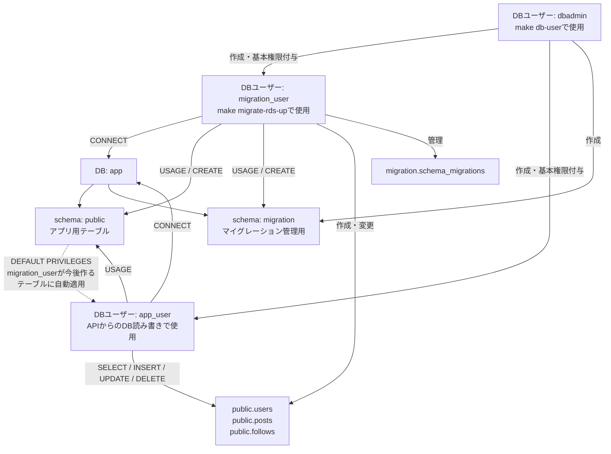

# DBユーザーとマイグレーション

## 目指す流れ

1. dbadminで migration_user と app_user を作る。
2. migration_userで最初のマイグレーションを実行する。
3. migration_userが作ったpublic配下のテーブルに、app_userの読み書き権限が自動付与される。

ユーザー作成自体には、テーブルは必要ない。

実行順序は次の通り。

| 順序 | コマンド | 目的 |
| ---- | -------- | ---- |
| 1 | make db-user | dbadminでmigration_user・app_userを作成し、基本権限を付与する |
| 2 | make migrate-rds-up | migration_userでテーブルを作成・変更する |
| 3 | - | default privilegesにより、作成済みテーブルへの読み書き権限は自動付与される |

初回の`make db-user`時点では、まだusers・posts・followsは存在しない。そのため、個別テーブルへのGRANTは行わない。代わりに、migration_userが今後publicスキーマに作るテーブルへapp_userの読み書き権限が自動付与されるようにdefault privilegesを設定する。

## DBユーザーと権限対象

| DBユーザー | 実行元 | 権限対象 | 権限・役割 |
| ---------- | ------ | -------- | ---------- |
| dbadmin | make db-user | DBロール | app_user・migration_userを作成する |
| dbadmin | make db-user | migrationスキーマ | migration.schema_migrations用のスキーマを作成する |
| dbadmin | make db-user | default privileges | migration_userが今後public配下に作るテーブルへ、app_userの読み書き権限を自動付与する設定を作る |
| migration_user | make migrate-rds-up | appデータベース | 接続する（CONNECT） |
| migration_user | make migrate-rds-up | publicスキーマ | アプリ用テーブルを作成・変更する（USAGE・CREATE） |
| migration_user | make migrate-rds-up | migrationスキーマ | schema_migrationsを作成・更新する（USAGE・CREATE） |
| migration_user | make migrate-rds-up | public.users / public.posts / public.follows | テーブル作成者として構造を管理する |
| app_user | ECS api | appデータベース | 接続する（CONNECT） |
| app_user | ECS api | publicスキーマ | 利用する（USAGE） |
| app_user | ECS api | public.users / public.posts / public.follows | API経由で読み書きする（SELECT・INSERT・UPDATE・DELETE） |

## ユーザーの役割

- dbadmin：初期設定でユーザー・権限を用意する。
- migration_user：テーブルを作成・変更する。CI/CDのマイグレーションでも使用する。
- app_user：アプリからデータを読み書きする。

## ECSとCI/CD

開発者が単発のECSタスクを起動し、タスク内からmigration_userでDBへ接続する構成を目指す。将来は同じタスクをCI/CDから起動する。

CI/CDにはタスクを起動するAWSのIAM権限を与える。DB接続には引き続きmigration_userを使い、その認証情報はSecrets Managerからタスクへ渡す。CI/CD自体にDBのパスワードを渡す必要はない。

## 現在の実装との差

Secret名は「db/dbadmin」「db/app_user」「db/migration_user」。

3つともusername・passwordのJSON形式で保存する。既存のapp_user・migration_userのURLは、make db-userの再実行で同じパスワードのJSONへ変換する。APIはDB_USER・DB_PASSWORDをSecretから取得し、接続先はECSの環境変数で指定する。

Secretの形式変更に合わせて、新しいAPIイメージのビルド・pushとタスク定義の適用が必要。旧APIイメージのまま新しい環境変数設定で起動しない。

管理コマンドからのSecret保存には、所有者だけが読み書きできる一時ファイル（0600）を使う。通常の成功・失敗時には削除するが、強制終了時は残る可能性がある。

dbadmin用SecretとRDS自動管理の解除設定は追加済み。パスワードは実行時に渡し、Stateに残さず同じ値をSecretとRDSへ設定する。更新時は両方で共通のパスワード版番号を増やす。失敗時の再実行には同じパスワードを使う。

infrastructure/stg/.env.exampleを.envへコピーし、2つのTF_VAR値を設定する。同ディレクトリのmake plan・make applyが.envを読み込む。.envはGit管理対象外だが、ローカルには平文で保存される。terraformコマンドを直接実行する場合は自動では読み込まない。

ユーザーによるRDS変更のapplyは完了。管理コマンドはdb/dbadminを使用する。APIタスクはdb/app_user、マイグレーションタスクはdb/migration_userを参照する設定。

既存Secretの名前変更は置き換えになる。旧Secretに値がある場合は、削除前に新Secretへ同じ値を移してから参照を切り替える。Terraformは値をコピーしないため、そのままapplyしない。

- マイグレーションのGoコードはmigration_userのみ許可する。タスク実行ロールもdb/migration_userのみ取得を許可する。
- db-userコマンドはapp_userとmigration_userを作成する。認証情報は別々のSecrets Managerへ保存する。migration_user用の保存先をTerraformで作成してから実行する。実DBへの適用は未確認。
- マイグレーション用イメージを再ビルド・pushし、stg/aws.tfのタグ更新とapply後に単発実行で確認する。今回のコード変更はAWSへ未反映。
- make db-userはapp_userとmigration_userを作成し、基本権限・migrationスキーマ・publicのdefault privilegesを設定する。テーブル作成はmigration_userで実行するマイグレーションに寄せる。
- CI/CDからの起動は未実装。
