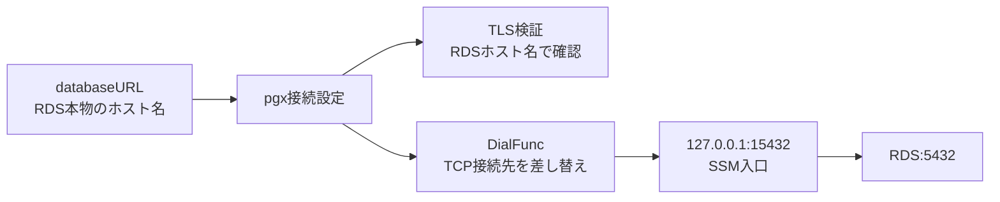

# DBトンネル接続

このドキュメントは、[`backend/internal/dbadmin/tunnel.go`](../internal/dbadmin/tunnel.go)の実装を説明する。

## シェルのトンネルとGoのトンネル

`make db-tunnel`は、SSMポートフォワードを開始する。

```text
開発者PCの127.0.0.1:15432
  -> SSM
  -> nat-instance
  -> RDS:5432
```

`cmd/db-user --tunnel 127.0.0.1:15432`は、すでに開いている入口をGoコードに渡すだけ。Goコード自体はSSMセッションを開始しない。

## `OpenDatabase`

```go
func OpenDatabase(databaseURL, tunnel string) (*sql.DB, error) {
    // databaseURLにはRDS本物のホスト名を入れておく。TLS検証でこのホスト名を使うため。
    config, err := pgx.ParseConfig(databaseURL)
    if err != nil {
        return nil, errors.New("invalid database configuration")
    }
    if err := configureTunnel(config, tunnel); err != nil {
        return nil, err
    }
    return stdlib.OpenDB(*config), nil
}
```

`databaseURL`をpgxの接続設定へ変換し、必要ならSSMトンネル用の設定を追加する。ここではまだDBへ接続しない。実際の接続は後続の`PingContext`や`QueryContext`などで発生する。

## `configureTunnel`

```go
func configureTunnel(config *pgx.ConnConfig, endpoint string) error {
    if endpoint == "" {
        return nil
    }
    // endpointはRDSではなく、ローカルPC上のSSMポートフォワード入口。
    // 例: 127.0.0.1:15432
    host, port, err := net.SplitHostPort(endpoint)
    if err != nil {
        return errors.New("tunnel must be a loopback IP and port")
    }
    ip := net.ParseIP(host)
    p, err := strconv.Atoi(port)
    // ローカルのSSMトンネルだけを許可するため、127.0.0.1のようなloopback IPに限定する。
    if ip == nil || !ip.IsLoopback() || err != nil || p < 1 || p > 65535 {
        return errors.New("tunnel must be a loopback IP and valid port")
    }
    dialer := net.Dialer{Timeout: 10 * time.Second}
    // pgxの接続処理を差し替え、実際のTCP接続だけendpointへ向ける。
    // これによりTLS検証先はRDSホスト名のまま、接続先だけ127.0.0.1:15432になる。
    config.DialFunc = func(ctx context.Context, network, _ string) (net.Conn, error) {
        return dialer.DialContext(ctx, network, endpoint)
    }
    // endpointのhostは検証済みのloopback IPなので、DNS解決せずそのまま使わせる。
    config.LookupFunc = func(context.Context, string) ([]string, error) { return []string{host}, nil }
    return nil
}
```

`endpoint`には`127.0.0.1:15432`のようなローカルのSSM入口を渡す。RDSホスト名や外部ホストを渡さないように、loopback IPと有効なportだけを許可する。

`config.DialFunc`で、pgxが実際にTCP接続する先を`endpoint`へ差し替える。一方で、`databaseURL`上のRDSホスト名は残しているため、TLS証明書の検証は`127.0.0.1`ではなくRDSホスト名に対して行われる。



```text
TLS検証先: RDS本物のホスト名
TCP接続先: 127.0.0.1:15432
```
