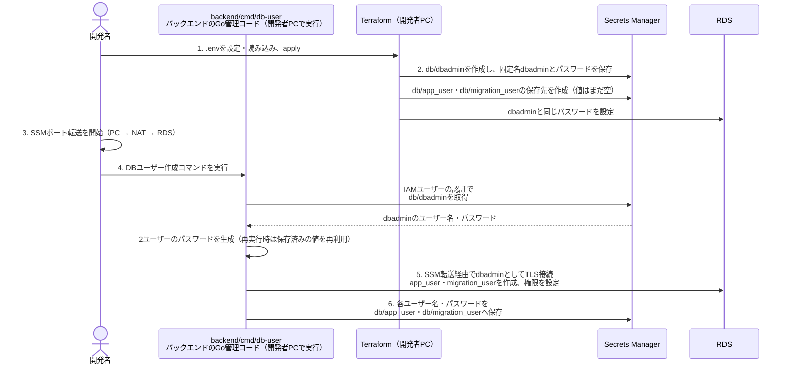
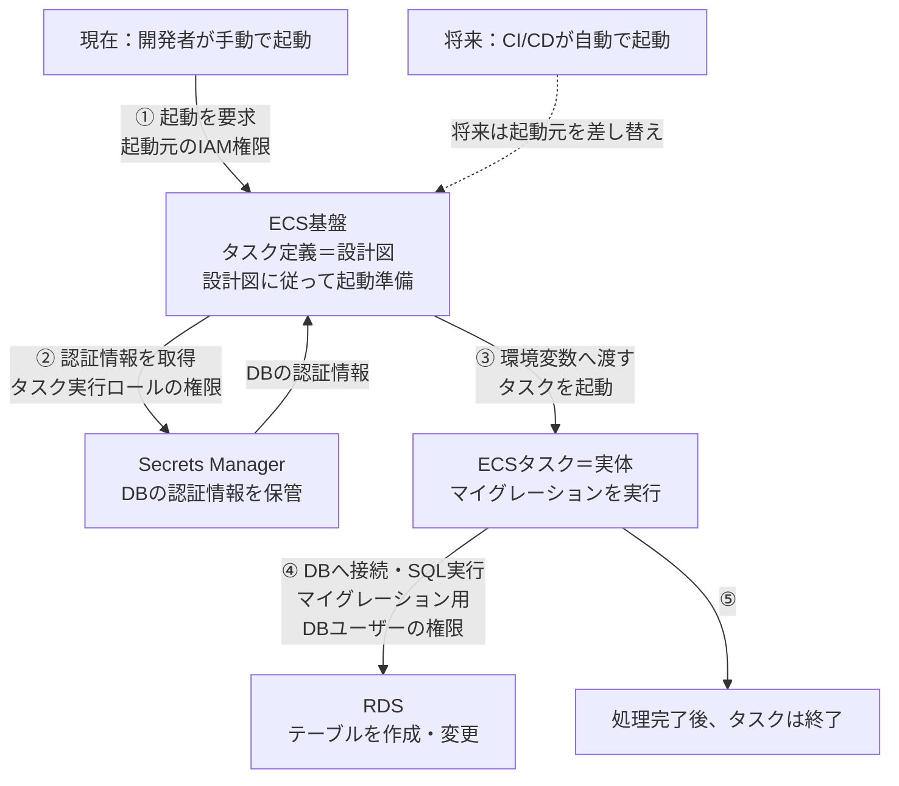
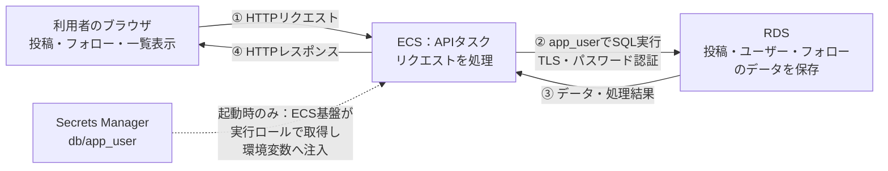
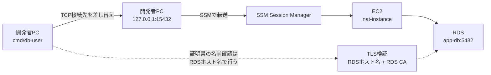

# AWSインフラ構成

## 1. VPC・サブネットとリソース配置

VPC（10.0.0.0/16）の中に、次の4つのサブネットがある。

| VPC内のサブネット | CIDR          | 現在配置されているリソース                        |
| ----------------- | ------------- | ------------------------------------------------- |
| ├ public-1a       | 10.0.0.0/18   | NATインスタンス（EC2）。外向き通信とSSM接続の中継 |
| ├ public-1c       | 10.0.64.0/18  | なし                                              |
| ├ private-1a      | 10.0.128.0/18 | APIのECSタスク、RDS（app-db）                     |
| └ private-1c      | 10.0.192.0/18 | なし                                              |

## 2. リソースとセキュリティーグループの対応・許可する通信

| AWSリソース       | セキュリティグループ名 | 用途                      | インバウンドルール                                                                                              | アウトバウンドルール                  |
| ----------------- | ---------------------- | ------------------------- | --------------------------------------------------------------------------------------------------------------- | ------------------------------------- |
| EC2：nat-instance | nat-instance           | 外向き通信・SSM接続の中継 | 10.0.128.0/18・10.0.192.0/18から全プロトコル許可 EC2 Instance ConnectのAWS管理プレフィックスリストからTCP 22 | 0.0.0.0/0へ全プロトコル許可           |
| ECS：api          | api                    | APIサーバー               | nat-instance SGからTCP 8080（手動API確認）                                                                      | db SGへTCP 5432 0.0.0.0/0へTCP 443 |
| ECS：db-migrator  | db-migrator            | DBマイグレーション        | なし                                                                                                            | db SGへTCP 5432 0.0.0.0/0へTCP 443 |
| RDS：app-db       | db                     | PostgreSQL                | api・db-migrator・nat-instance SGからTCP 5432                                                                   | なし（許可済み接続への応答は可能）    |

## 3. IAMユーザー・ロール・ポリシー

| 利用者・AWSリソース | IAMユーザー／ロール名                    | 用途                                     | アタッチする権限ポリシー                     | 許可する操作・対象                                                                                   |
| ------------------- | ---------------------------------------- | ---------------------------------------- | -------------------------------------------- | ---------------------------------------------------------------------------------------------------- |
| 開発者PC            | x-clone-terraform-stg（IAMユーザー）     | Terraform・AWS CLI・DB管理コマンドの実行 | AdministratorAccess（AWS管理）               | 全AWS操作・全リソース（ポリシー上の許可。SCP等の制約は未確認）                                       |
| ECS：api            | api-task-execution（実行ロール）         | ECS基盤によるコンテナ起動・ログ送信      | api-task-execution（カスタマー管理）         | ECR apiのイメージ取得 /ecs/backendへのログ送信 db/app_userのSecret取得                         |
| ECS：api            | api-task（タスクロール）                 | APIプログラムのAWS操作用                 | なし                                         | AWS操作権限なし。DBの読み書きはapp_userのSQL権限                                                     |
| ECS：db-migrator    | db-migrator-task-execution（実行ロール） | ECS基盤によるコンテナ起動・ログ送信      | db-migrator-task-execution（カスタマー管理） | ECR db-migratorのイメージ取得 /ecs/backend-migrationへのログ送信 db/migration_userのSecret取得 |
| ECS：db-migrator    | db-migrator-task（タスクロール）         | マイグレーションプログラムのAWS操作用    | なし                                         | AWS操作権限なし。DB変更はmigration_userのSQL権限                                                     |
| EC2：nat-instance   | nat-ssm（ロール）                        | SSM Agentの管理・通信                    | AmazonSSMManagedInstanceCore（AWS管理）      | SSMへの情報登録・管理用通信。DB操作・Secret取得の権限なし                                            |

## 4. DBユーザー・Secret・実行場所の関係

### dbadmin：初期設定・ユーザー管理用

- 開発者PCでbackend/cmd/db-userを実行するときに使う。API・マイグレーションのECSタスクでは使わない。
- migration_userとapp_userを作成する。
- 各ユーザーへ必要な権限を付与する。

### migration_user：マイグレーション用

- 単発実行するECSタスクdb-migratorが、DBへ接続するときに使う。
- 現在は開発者がタスクを起動する。将来はCI/CDから同じタスクを起動し、デプロイ時のテーブル作成・変更に使う。
- CI/CDがタスクを起動する権限はIAM、タスク内からDBを変更する権限はmigration_userが担う。
- appデータベースに接続する（CONNECT）。
- publicスキーマを利用し、テーブルを作成する（USAGE・CREATE）。
- migration_userで実行するマイグレーションにより、public配下のアプリテーブルを作成・変更する。
- マイグレーション管理用のschema_migrationsはmigrationスキーマで管理する。

### app_user：API用

- ECSサービスで常時動かすAPIタスクapiが、DBへ接続するときに使う。
- アプリ利用者が画面から投稿・フォロー・タイムライン表示を操作すると、APIがapp_userとしてDBを読み書きする。
- appデータベースに接続する（CONNECT）。
- publicスキーマを利用する（USAGE）。
- 存在するusers・posts・followsのデータを取得・追加・更新・削除する（SELECT・INSERT・UPDATE・DELETE）。
- テーブルの作成・構造変更・削除は行わない。

### 初期設定

### migration_user:マイグレーション（現在の手動起動と将来のCI/CD）

現在も将来も、db-migratorは処理が終わると終了する単発のECSタスク。将来は起動元を開発者PCからCI/CDへ切り替える。CI/CDは未実装。

CI/CDはDBへ直接接続しない。起動元を切り替えても、Secretの取得はECS基盤、DBへの接続・SQL実行はタスク内のGoプログラムが担当する。マイグレーションタスクからRDSへの接続にSSMポート転送は使わない。

### app_user：APIからのデータ読み書き

app_userを使うのはAPI。利用者はHTTPでAPIを操作し、RDSへ直接接続しない。Secretの取得はタスク起動時に行い、HTTPリクエストのたびには取得しない。

## 5. 管理・実行経路

### SSMポートフォワード

`cmd/db-user`は、RDSへ直接接続せず、ローカルの`127.0.0.1:15432`へ接続する。その通信をSSMがnat-instance経由でRDSへ転送する。

接続先の差し替えとTLS検証の詳細は、[DBトンネル接続](../backend/docs/db-tunnel.md)を参照。

## 6. 残りの対応

- 作業用IAMユーザーはAdministratorAccess。用途別の最小権限化は未実施。
- NATは単一障害点。APIも通常1タスク、RDSもSingle-AZであり、全体として冗長構成ではない。
- stg/aws.tfに残るdbadmin_references_ready=falseと「applyを禁止する」コメントは、現在のRDSリソースで停止条件として使われていない。
